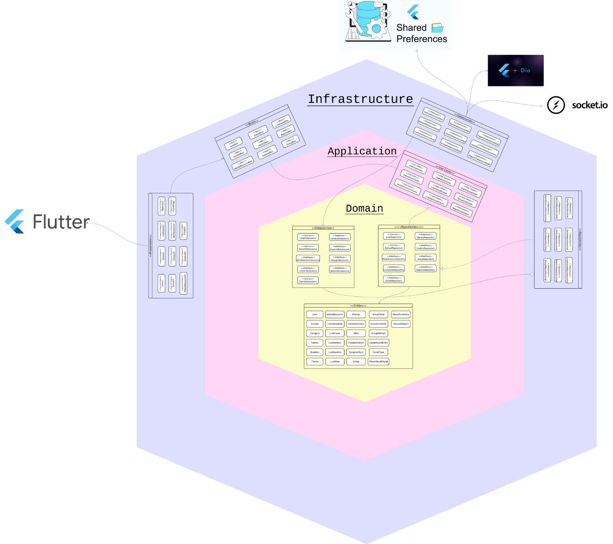

# ¡Bienvenido al Frontend del equipo Amarillo QUIZZY!

Quizzy es una aplicación móvil estilo Kahoot en la que usuarios pueden crear, explorar y jugar quices de diversos temas. Sumérgete en la educación divertida!

# Arquitectura 

La aplicación fue desarrollada siguiendo patrones de diseño y arquitecturas que fomentan el clean code y el desarrollo de software sostenible. Sigue principios SOLID, los cuales brindan un código escalable, mantenible y fácil de testear. 

Sigue la Arquitectura Hexagonal; formada por 3 capas: dominio, aplicación e infraestructura, utiliza Puertos y Adaptadores con Inversión de Dependencias (favoreciendo el Principio SOLID DIP). Introducida por primera vez en el 2005 por Alistair Cockburn, permite que el código se almacene en capas dentro de la aplicación, de manera que se pueda aislar la lógica de dominio (lógica de negocio), la lógica de aplicación (casos de uso) y detalles de infraestructura (detalles técnicos). 

# ¿Cómo pruebo el proyecto?

Abrimos la carpeta principal "kahoot" una consola en Bash y ejecutamos los comandos:

1) Para instalar dependencias:
flutter pub get

2) Para correr el proyecto:
flutter run

3) Agrega un .env con tu APIKEY de Gemini para usar la IA (es sorpresa, descúbrela!)

# Diviértete y sigue aprendiendo!!
